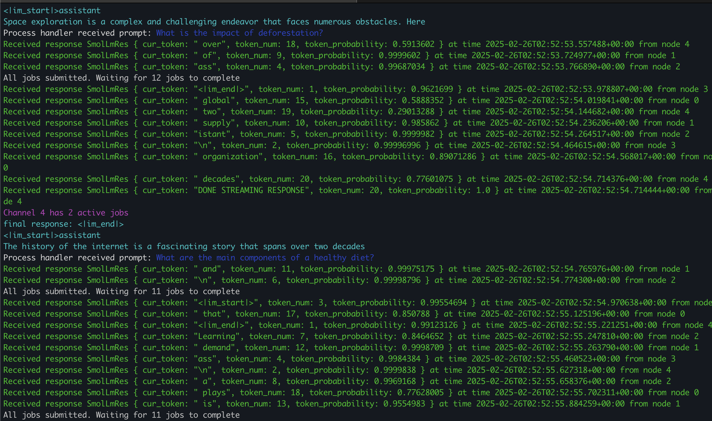

# SmolLM Inference Engine with Load Balancing

A distributed inference system for running SmolLM language models at scale, built with Rust and gRPC.

## Overview

This project implements a high-performance inference engine for SmolLM language models with the following key features:

- **Load Balanced Inference**: Requests are automatically distributed across 5 Docker containers running SmolLM models
- **Real-time Streaming**: Tokens are streamed back to clients as they're generated using gRPC streaming
- **Docker Compose Setup**: Simple containerized deployment with Docker Compose managing the container fleet
- **Rust Implementation**: High-performance load balancer and client written in Rust with async support
- **Python Inference Node**: Efficient Python implementation using HuggingFace Transformers for model inference
- **gRPC Streaming**: Custom Python gRPC service that streams tokens as they're generated by the model

The system architecture consists of:

- A Rust load balancer that distributes incoming requests
- 5 Docker containers each running a SmolLM model instance
- Client libraries for making inference requests
- Python inference nodes that handle model loading and token generation
- gRPC streaming service implemented in Python using the `grpc` library

## Running the System

Instructions for running:

1. Open your Docker Daemon. Navigate to `pyInference/inferenceNode` and run `docker build -t smollm .`. Then run `docker-compose up -d`.
2. Navigate to `rustClient`. Edit `jobs.txt` with the prompts you would like to have inference run on. Run `cargo build` and then `cargo run --bin LMClient`.

## Example Terminal Output

1. Each green portion represents a token being streamed back from the client.
2. Each dark blue portion represents when a new prompt starts being processed by a node.
3. Each light blue portion represents the final SmolLM output for a given prompt.
4. Each purple portion represents an update on the number of jobs either queued/in progress for a certain node after a job is completed.
